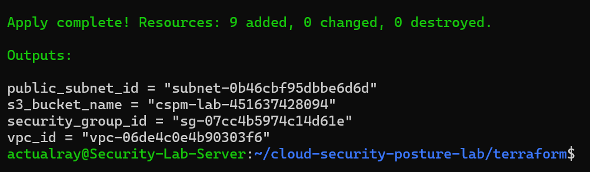
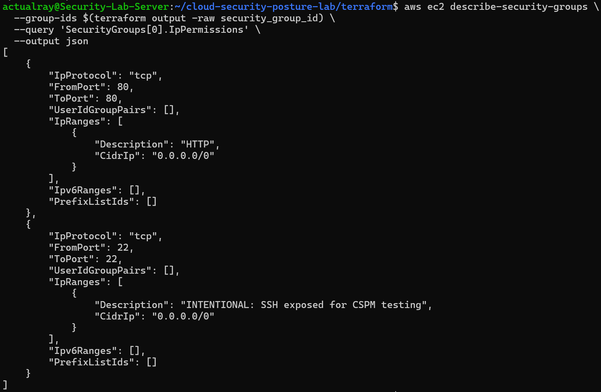
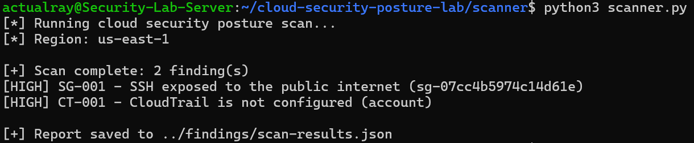
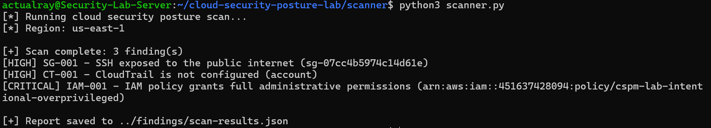
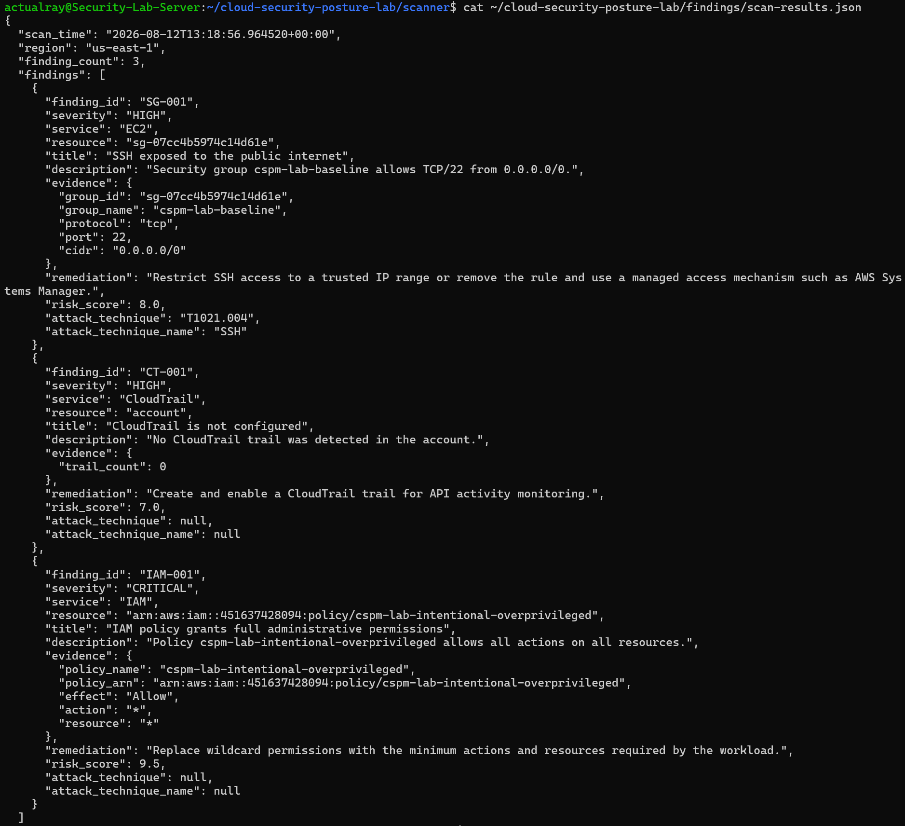
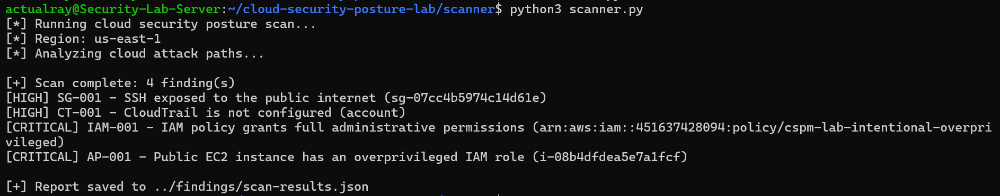
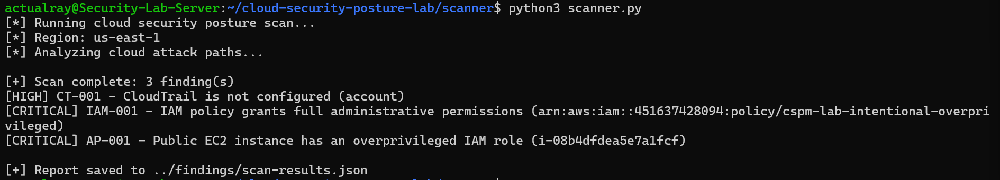

# Cloud Security Posture Management & Attack-Path Analysis Lab

## Overview

This project is a small Cloud Security Posture Management (CSPM) lab built on AWS.

The goal was to create an intentionally misconfigured cloud environment, develop a custom security scanner to identify the weaknesses, analyze how individual misconfigurations could combine into a realistic attack path, and then remediate the issues using Infrastructure as Code.

The project follows a simple security workflow:

**Build → Scan → Analyze → Remediate → Rescan**

The final environment was successfully brought to a clean security posture, with the custom scanner reporting **0 findings**.

---

## Project Objectives

The project was designed to demonstrate practical experience with:

- AWS cloud infrastructure
- Infrastructure as Code using Terraform
- Cloud security posture management
- IAM least-privilege analysis
- EC2 security
- Security Group analysis
- S3 security configuration
- AWS CloudTrail
- Attack-path analysis
- Automated security scanning
- Security remediation and validation
- Evidence collection and before/after comparison

---

## Architecture

The lab was deployed in AWS using Terraform.

The environment contains:

- A VPC
- A public subnet
- An Internet Gateway
- A public route table
- A public EC2 instance
- An EC2 Security Group
- An IAM role and instance profile
- An S3 bucket
- AWS CloudTrail

The infrastructure was intentionally configured with security weaknesses during the initial stage so that the scanner could detect them.

---

## Repository Structure

```text
cloud-security-posture-lab/
│
├── terraform/
│   ├── main.tf
│   ├── variables.tf
│   ├── outputs.tf
│   └── .terraform.lock.hcl
│
├── scanner/
│   └── scanner.py
│
├── findings/
│   └── scan-results.json
│
├── evidence/
│   ├── after/
│   │   ├── cloudtrail.json
│   │   ├── cloudtrail-status.json
│   │   ├── ec2.json
│   │   ├── final-main.tf
│   │   ├── final-scan.json
│   │   ├── iam-policy.json
│   │   ├── iam-policy-metadata.json
│   │   └── security-group.json
│   └── final-scan-results.json
│
├── screenshots/
│   ├── 01-terraform-baseline-deployment.png
│   ├── 02-public-ssh-misconfiguration.png
│   ├── 03-automated-cspm-detection.png
│   ├── 04-cspm-iam-detection.png
│   ├── 05-risk-scoring-attack-mapping.png
│   ├── 06-attack-path-detection.png
│   └── 07-remediation-ssh-verified.png
│
├── README.md
└── .gitignore
```

---

## Project Screenshots

The screenshots document the main stages of the project, from the initial Terraform deployment through vulnerability detection, attack-path analysis, and remediation.

### 1. Terraform Baseline Deployment

The initial AWS environment was deployed using Terraform.



### 2. Public SSH Misconfiguration

The initial Security Group intentionally allowed SSH from the public internet.



### 3. Automated CSPM Detection

The custom Python scanner identified security weaknesses in the AWS environment.



### 4. IAM Misconfiguration Detection

The scanner identified an intentionally overprivileged IAM policy.



### 5. Risk Scoring and Attack Mapping

Findings were assigned risk scores and mapped to relevant attack techniques where applicable.



### 6. Attack-Path Detection

The scanner correlated the public EC2 instance with its overprivileged IAM role and identified the resulting attack path.



### 7. Remediation Verification

After remediation, the exposed SSH rule was removed and the AWS configuration was validated.



---

## 1. Initial Security Posture

The first version of the environment intentionally contained several security weaknesses.

The scanner identified the following findings:

| ID | Severity | Finding |
|---|---|---|
| SG-001 | HIGH | SSH exposed to the public internet |
| CT-001 | HIGH | CloudTrail was not configured |
| IAM-001 | CRITICAL | IAM policy granted full administrative permissions |
| AP-001 | CRITICAL | Public EC2 instance had an overprivileged IAM role |

These findings were deliberately introduced to create a realistic CSPM testing environment.

---

## 2. Security Group Misconfiguration

The EC2 Security Group initially allowed:

```text
TCP/22 → 0.0.0.0/0
```

This exposed SSH to the public internet.

The scanner detected this configuration as:

```text
[HIGH] SG-001 - SSH exposed to the public internet
```

The finding included evidence showing the Security Group ID, protocol, port, and CIDR range.

### Remediation

The public SSH rule was removed using Terraform.

The remaining HTTP rule was retained because the lab infrastructure still required public HTTP exposure for testing.

After remediation, the Security Group no longer allowed TCP/22 from the internet.

---

## 3. IAM Overprivilege

The initial IAM policy contained:

```json
{
  "Effect": "Allow",
  "Action": "*",
  "Resource": "*"
}
```

This effectively granted unrestricted permissions.

The scanner identified this as:

```text
[CRITICAL] IAM-001 - IAM policy grants full administrative permissions
```

### Remediation

The wildcard permissions were replaced with a restricted policy containing only the permissions required by the lab workload.

The policy was also updated to indicate that it was no longer an intentional overprivileged configuration.

This demonstrates the principle of least privilege.

---

## 4. Attack-Path Analysis

The most important finding was not an isolated configuration problem.

The lab demonstrated how multiple weaknesses could combine into a larger security risk.

The initial environment contained:

```text
Public Internet
      |
      v
Public EC2 Instance
      |
      v
IAM Instance Profile
      |
      v
Overprivileged IAM Role
      |
      v
Action: *
Resource: *
```

The EC2 instance had:

- A public IP address
- A publicly reachable Security Group
- An IAM instance profile
- An IAM role with unrestricted permissions

The scanner therefore generated:

```text
[CRITICAL] AP-001 - Public EC2 instance has an overprivileged IAM role
```

This demonstrates why cloud security findings should not always be treated independently.

A publicly exposed workload becomes significantly more dangerous when the identity attached to that workload has excessive permissions.

---

## 5. CloudTrail

Initially, no CloudTrail trail was detected.

The scanner reported:

```text
[HIGH] CT-001 - CloudTrail is not configured
```

Without CloudTrail, investigating suspicious API activity becomes significantly more difficult.

### Remediation

A multi-region CloudTrail trail was added using Terraform.

The trail was configured to write logs to the project's S3 bucket.

The S3 bucket policy was also configured to allow the CloudTrail service to perform the required bucket ACL and log-delivery operations.

CloudTrail logging was then verified using the AWS CLI.

The final validation showed:

```text
Logging: True
```

---

## 6. Custom CSPM Scanner

The project includes a Python-based scanner located at:

```text
scanner/scanner.py
```

The scanner uses `boto3` to inspect AWS resources.

### Security Group Checks

The scanner detects:

- SSH exposed to `0.0.0.0/0`
- RDP exposed to `0.0.0.0/0`

### S3 Checks

The scanner checks:

- S3 Block Public Access configuration
- Default server-side encryption

### CloudTrail Checks

The scanner checks whether a CloudTrail trail exists.

### IAM Checks

The scanner searches IAM policies for unrestricted:

```text
Action: *
Resource: *
```

permissions.

### Attack-Path Checks

The scanner correlates infrastructure information to identify a more significant condition:

```text
Public EC2
    +
Overprivileged IAM role
    =
High-risk attack path
```

Findings are enriched with:

- Severity
- Risk score
- AWS service
- Resource
- Evidence
- Remediation guidance
- MITRE ATT&CK technique information where applicable

---

## 7. Before and After

### Initial Scan

The initial environment produced:

```text
4 finding(s)
```

Including:

```text
[HIGH] SG-001
[HIGH] CT-001
[CRITICAL] IAM-001
[CRITICAL] AP-001
```

These findings represented the intentionally vulnerable starting state.

### Remediation

The identified issues were remediated using Terraform:

1. Public SSH access was removed.
2. The overprivileged IAM policy was replaced with a least-privilege policy.
3. CloudTrail was deployed.
4. CloudTrail logging was verified.
5. AWS configuration was validated using the AWS CLI.

### Final Scan

The scanner was executed again after remediation.

The final result was:

```text
[+] Scan complete: 0 finding(s)
```

This provides measurable confirmation that the security controls implemented during remediation satisfied the checks implemented by the custom scanner.

---

## 8. Evidence

Evidence collected during the project is stored under:

```text
evidence/after/
```

The evidence includes:

- Final Terraform configuration
- EC2 configuration
- Security Group configuration
- IAM policy
- IAM policy metadata
- CloudTrail configuration
- CloudTrail status
- Final scanner results

The evidence provides a reproducible record of the final security posture.

---

## 9. Technologies Used

- AWS
- EC2
- IAM
- S3
- VPC
- Security Groups
- CloudTrail
- Terraform
- Python
- Boto3
- AWS CLI
- Linux / Ubuntu
- JSON

---

## 10. What I Learned

This project helped demonstrate several practical cloud-security concepts.

### Misconfigurations can create attack paths

A vulnerability is not always significant on its own.

The combination of public network exposure and excessive IAM permissions created a much more serious risk than either issue considered separately.

### Least privilege is important

Using:

```text
Action: *
Resource: *
```

for a workload role creates unnecessary blast radius.

Permissions should be limited to what the workload actually needs.

### Infrastructure as Code makes remediation repeatable

Terraform allowed the environment to be changed in a controlled and reproducible way rather than manually modifying individual AWS resources.

### Detection should be followed by validation

A security scanner is more useful when it can be run before and after remediation.

The final scan provided measurable confirmation that the identified issues had been addressed.

---

## 11. Conclusion

This lab demonstrates a complete cloud security posture workflow:

```text
1. Deploy cloud infrastructure
          ↓
2. Introduce intentional misconfigurations
          ↓
3. Scan the environment
          ↓
4. Identify security findings
          ↓
5. Correlate findings into attack paths
          ↓
6. Remediate using Terraform
          ↓
7. Validate AWS configuration
          ↓
8. Run the scanner again
          ↓
9. Confirm 0 findings
```

The project demonstrates practical experience with:

- AWS security
- IAM
- Cloud networking
- Infrastructure as Code
- Automated security assessment
- CSPM concepts
- Attack-path reasoning
- Security remediation
- Security validation

The final objective was achieved: the intentionally vulnerable cloud environment was remediated and the custom CSPM scanner reported **zero remaining findings**.
